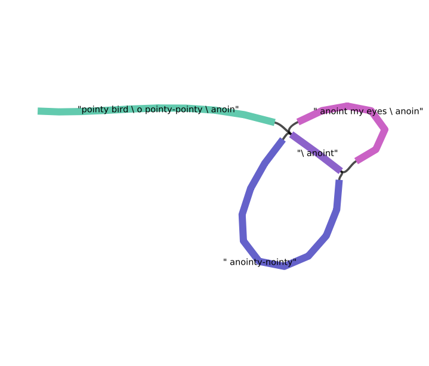

# cbgb
Coloured de Bruijn Graph Builder (& other methods for updating graph-edges)

This is a reference implementation for exploring graph algorithms on small
genome de Bruin graph assemblies. There is no intention to support
succinct datastructures.


```python3
from cbgb.omfug import lnec
from cbgb import CdB, kmerize, Edge

seq = "pointy bird \ o pointy-pointy \ anoint my eyes \ anointy-nointy"

def join_walk(walk):
    return ''.join(map(lambda c: c[-1:], walk))

for k in range(4, 10):
    g = CdB()
    for kmer in kmerize(seq, k=k):
        g.add(kmer, Edge())

    start = seq[:k-1]
    walk = join_walk(g.walk(start=start))
    print("{}-mer:\t{}".format(k, start[:-1] + walk))
```
Which yields
```
4-mer:	pointy-nointy \ anoint my eyes \ anointy-pointy bird \ o pointy
5-mer:	pointy-nointy \ anoint my eyes \ anointy-pointy bird \ o pointy
6-mer:	pointy-nointy \ anoint my eyes \ anointy-pointy bird \ o pointy
7-mer:	pointy \ anoint my eyes \ anointy-pointy bird \ o pointy-nointy
8-mer:	pointy bird \ o pointy-pointy \ anoint my eyes \ anointy-nointy
9-mer:	pointy bird \ o pointy-pointy \ anoint my eyes \ anointy-nointy
``` 

If we're interesting in enumerating the number of possible Eulerian cycles
for k,

```python
for k in range(2, 11):
    g = CdB()
    for kmer in kmerize(seq, k=k):
        g.add(kmer, Edge())

    g.circularize()
    graph, _ = g.to_adj()
    print("{}-mer:\te^{} cycles".format(k, lnec(graph)))
```

Giving:

```
2-mer:	e^62.73851624705093 cycles
3-mer:	e^33.7717247974044 cycles
4-mer:	e^24.99524900805808 cycles
5-mer:	e^17.317385507379875 cycles
6-mer:	e^10.514990744055561 cycles
7-mer:	e^4.564348191467836 cycles
8-mer:	e^1.3862943611198904 cycles
9-mer:	e^0.6931471805599453 cycles
10-mer:	e^0.0 cycles
```

Using the `compress()` and `to_gfa()` methods, we can visualize the output
with as a GFA file: 

### Monoidal edges
Integers for a multigraph, sets for labels

### Eulerian walk
Linear time assembly for well behaved, unlabelled de Bruijn graphs

### What's subdawg?
Extract a directed acyclic word subgraph from between two nodes

### Other methods
  * Enumerate Eulerian cycles with BEST theorem (efficiently as ln \left | L_G^* \right | + \sum_{u \in V} ln\Gamma d(u))
  * estimate optimal k-mer sizes with entropy/perplexity
